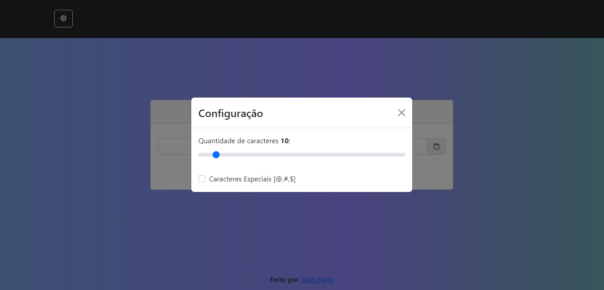
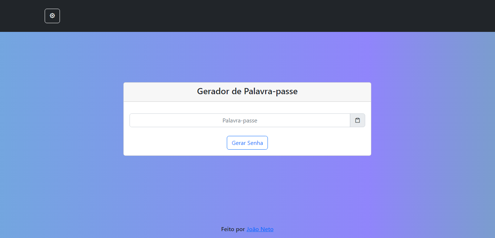

# Password-generator

Projecto de geração de senhas feito com HTML5, CSS3(Bootstrap5) e Javascript

Layout de natureza original do autor (Desenvolvidor)

Projecto tem como principal finalidade gerar senhas seguras de forma automática.
Abaixo poderás ver/encontrar uma imagem do Layout👇👇

Dentro dele ainda é possível que tu configures a quantidade de caracteres que desejas que a senha tenha,
com um mínimo de 8 caracteres e um máximo de 36 caracteres.

Pode ainda definir se a senha deve conter caracteres especiais como: @, #, $

Poderá ver o resultado do final do projecto aqui 👉 <a href="https://joao-neto-dh.github.io/Password-generator/">https://joao-neto-dh.github.io/Password-generator/</a>, hospedado nos servidores do github

Siga-me e não esqueça da sua estrela ⭐ ela faz toda diferença para o desenvolvimento

Desenvolvido por João Baptista Dala Lima Neto, desenvolvedor FrontEnd 🤩❤

Contactos:
    <ul>
        <li><a href="https://www.facebook.com/profile.php?id=100008974907202">Facebook</a></li>
        <li><a href="https://github.com/Joao-Neto-DH">Gitub</a></li>
        <li><a href="https://www.linkedin.com/in/jo%C3%A3o-neto-aa2481225/">Linkedln</a></li>
    </ul>